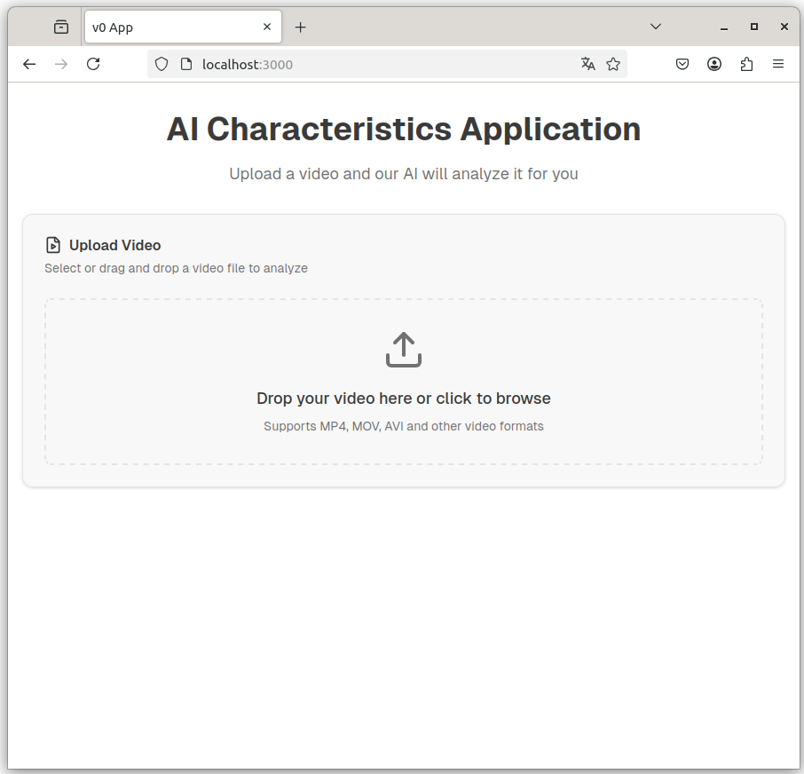
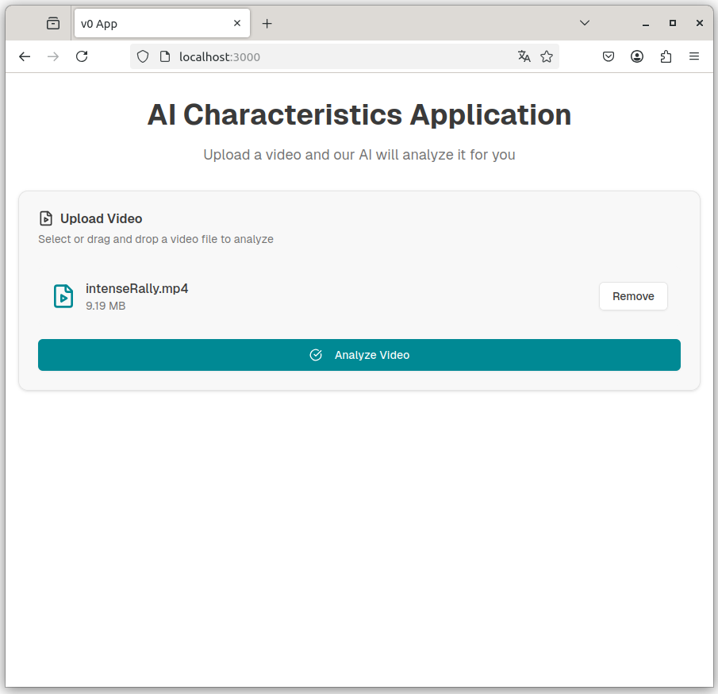
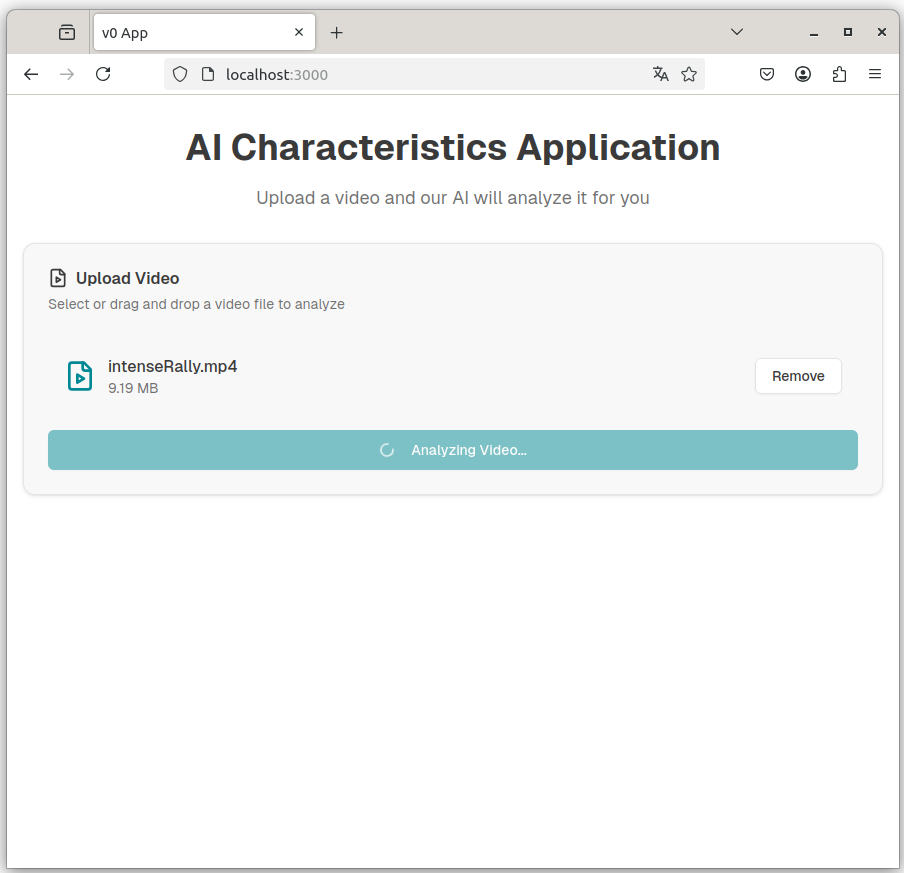
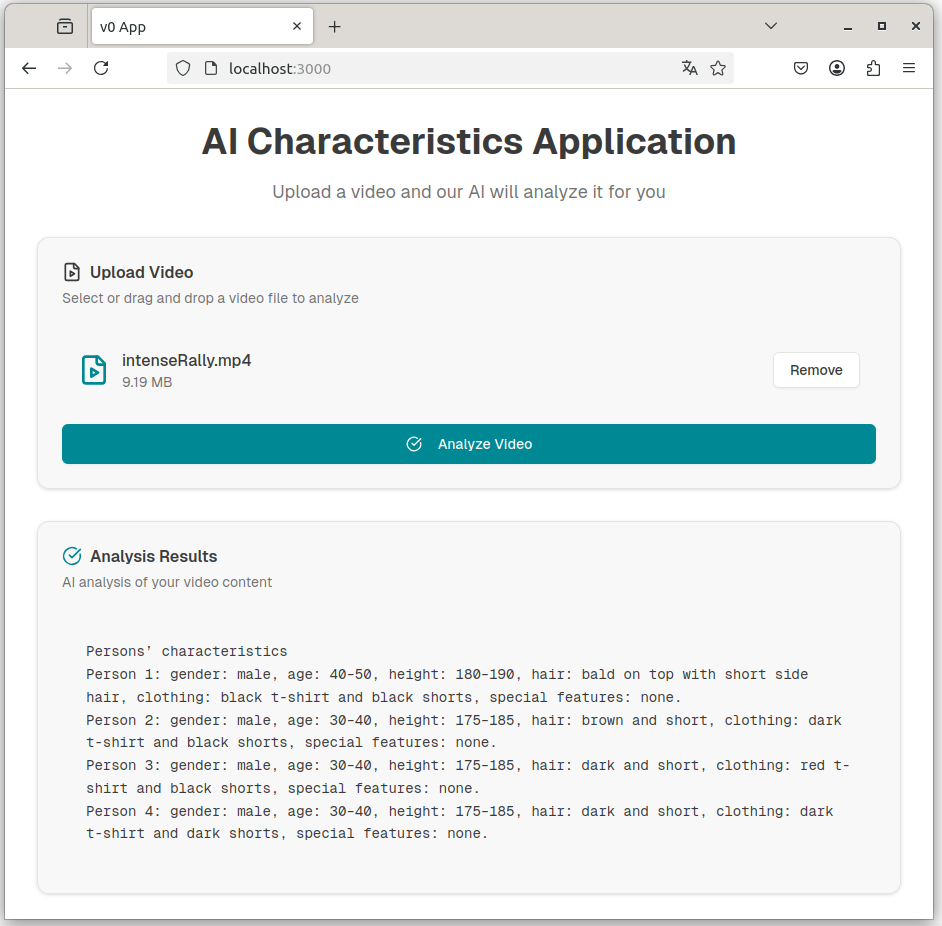

# Video analysis app

## An example application run






## Configuration

You can configure the application title, guide and the AI prompt. So you can analyze different things from the videos.

See the .env.example. Create your own .env file. It's include in the .gitignore, so the secrets don't go to the GitHub.

Create your Google cloud account, if you don't have it already. Configure also your Google Vertex AI environment variables in the .env file.

You can use these commands to get your environment variables:

```
gcloud auth login
```

```
gcloud config set project <your project id>
```

```
gcloud iam service-accounts create <your service account's name>
```

```
gcloud projects add-iam-policy-binding <your project id> --member="serviceAccount:<your service account's email>" --role="roles/aiplatform.user"
```

```
gcloud iam service-accounts keys create ~/keys/<your filename>.json --iam-account=<your service account's email>
```
Take the private key and other values from the json file.

## The commands to run the application

```
npm i
npm run dev
```

## Deploy to the Vercel platform

The project is tested to run also in the Vercel platform. Please note that there is quite short timeout value with the hobby plan (about 10s). I figured out that 1s video is able to analyse there. Locally I tried the application without problems with the 16s video.

Login to the Vercel platform with this url: https://vercel.com/login
